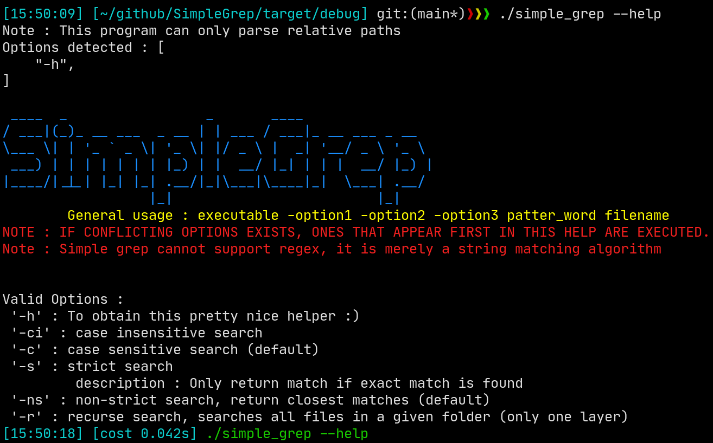
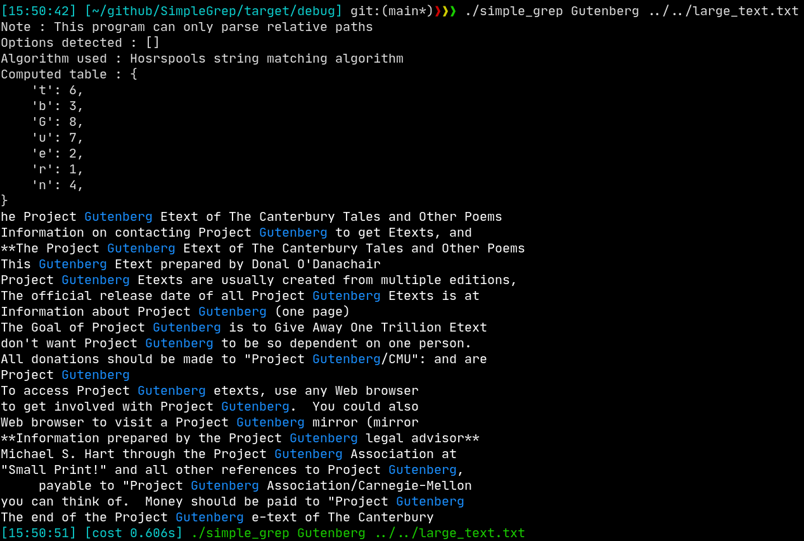
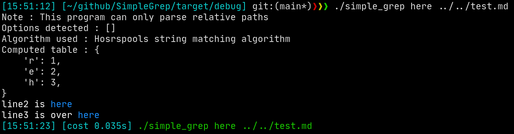
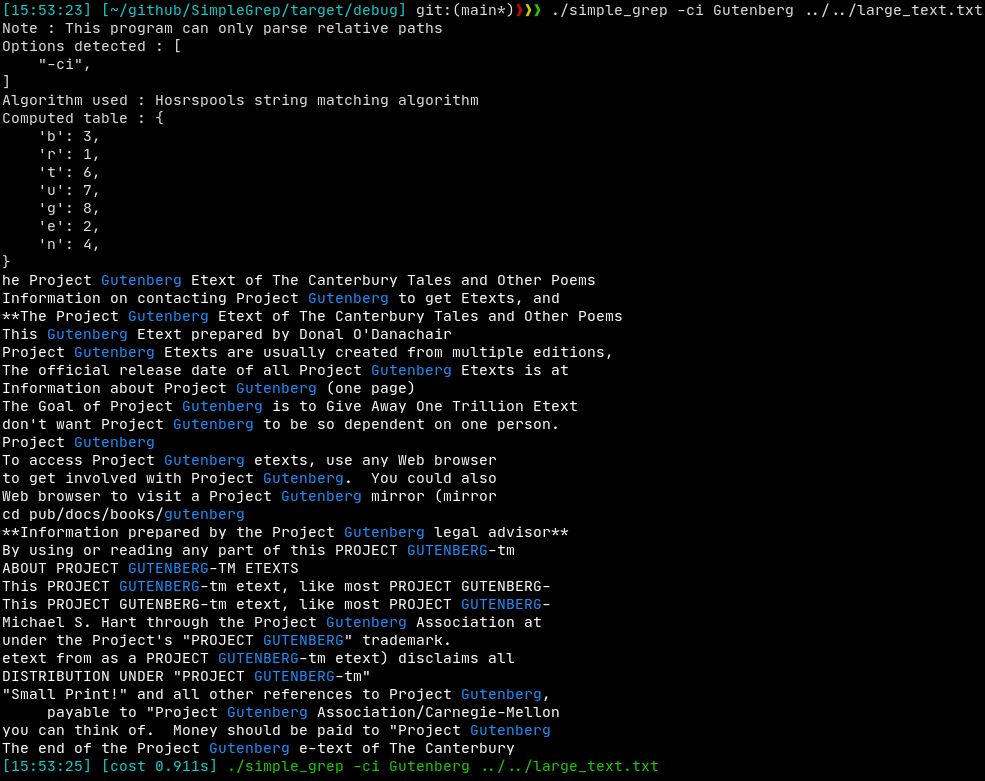

# SimpleGrep 

## About speed

A very simple and modified implementation of GREP in rust. Sadly SimpleGrep is not as fast as grep, why so? 
- GNU grep has the ability to skip kernel buffers to read text files directly, this alone take 0.3 second of 0.6 (in below screen shots).
- It implements a superior boyer-moores algorithm 
- It was written by far far experienced developers
- lastly, SimpleGrep is still under developments with main focus of higher speeds.

That given, SimpleGrep as of now borrows tricks from grep for speed like : 
- Using one large buffer to store the input file
  - If the program were to be memory efficient, we would have to split it into lines and searching for newlines takes time.

More avenues of speed up : 
- reduce number of instruction for each unmatch
- refactor code for reused values inorder to not calculat them everytime.

## Screenshots 

## Other WIP (apart from speed that is) 
- Implementing strict search 
- Implementing recurse search
